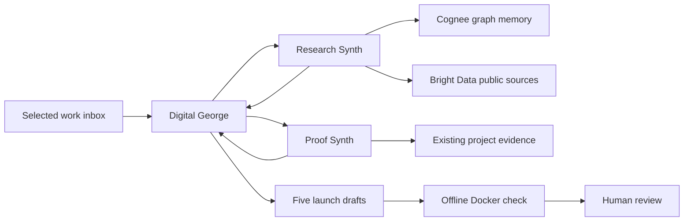

# Digital George · SYNTHOS

**Drop finished-work evidence into a local inbox. Get a launch pack grounded in your own memory and existing proof.**

Digital George is a personal launch concierge prototype: it recalls selected context from Cognee, delegates real work to Research Synth and Proof Synth, reads public sources through Bright Data, and creates five finished files inside a visible local workspace. George reviews the result; nothing is posted or sent.

[Watch / download the demo video](https://github.com/gtrush03/digital-george-synthos-demo/releases/download/demo-v1/Digital-George-SYNTHOS.mp4) · [Setup](STARTUP.md) · [Verified run](docs/VERIFIED-RUN.md)

The useful moment is reuse: a piece of existing work becomes a LinkedIn post, an X thread, an unsent introduction, a launch brief, and a proof kit. A fresh run can retrieve previously selected writing examples and explain privately which evidence shaped the copy. An explicit correction can be remembered and recalled in a later task.

## What actually runs

| Component | Concrete role |
| --- | --- |
| **Cognee** | Persistent selected memory; graph-context retrieval with `onlyContext=true` and source references. |
| **Bright Data** | Two bounded public-source reads with real success/error evidence. |
| **Strands Agents 1.56.0** | Three actual agents, tool loops, specialist handoffs and hooks. |
| **Codex subscription** | The official CLI, authenticated through ChatGPT, supplies reasoning. No model API-key fallback. |
| **Jev contracts · Codex subscription** | Pinned local Jev question-building, validation and interpretation contracts run on each proposed action. The same Codex response supplies advisory answers. This is **not Jev-model inference**, adds no second inference call, and never grants action authority. |
| **Docker** | A pinned, offline, read-only container checks artifact structure, citations and hashes. It does not establish factual truth. |
| **SYNTHOS** | The original native host and workspace. This repository provides the portable local dashboard and worker; it does not redistribute the native app. |

The observed fresh run completed with **five files, two specialist handoffs, ten subscription model calls, ten valid Jev contract receipts, and a passing Docker structural check**. Meta's page returned an error page; the system preserved that error and avoided inventing a product comparison. See [the sanitized verification summary](docs/VERIFIED-RUN.md).

## Run it locally

Requires Node 25+, Python 3.13, `uv`, Docker, a Codex CLI version supporting the flags used in `codex_model.py`, and your own authenticated Cognee/Bright Data accounts. The native demonstration used a MacBook Pro. Sponsor services can consume your own service credits; this repository grants no credits.

Follow [STARTUP.md](STARTUP.md). The dashboard defaults to a local preview at `http://localhost:7999`; live execution requires explicit configuration. Private memory, accounts, runtime receipts and credentials are not included.

## Scope

This is a bounded hackathon prototype, not a full digital twin or a proven unattended production system. The local inbox watcher runs while the process is alive; it does not guarantee laptop sleep recovery. It has no social-publishing, email-sending, payment or job-application tool. Tenki is not integrated. Claude is not the implemented reasoning adapter in this snapshot.

External project films remain external links; none are redistributed here. The optional release video is a separate demonstration recording. Source and dependency attribution is in [THIRD-PARTY-NOTICES.md](THIRD-PARTY-NOTICES.md).
